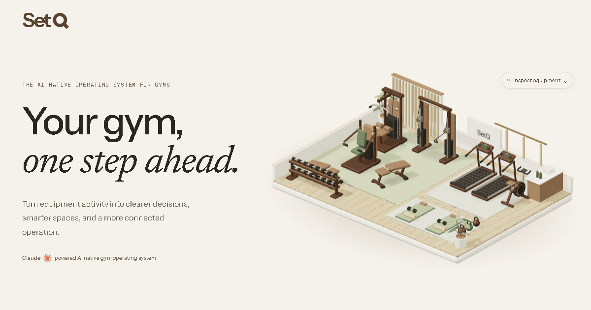

# SetQ

Premium marketing site for SetQ, the AI native operating system for gyms. Built as its own repository, separate from the hardware prototype and gym-tracker software.



[Open the website preview](https://mohammedtalhaans.github.io/setq-website/)

**Brand/domain:** SetQ · setq.com.au
**Demo enquiries:** founder@setq.com.au

## Run

Node 24 or newer.

```powershell
npm ci
npm run dev
```

Local site: http://127.0.0.1:13073/.

```powershell
npm run build
npm run preview
```

Build output is `dist/`, suitable for any static host. Fonts, models, illustrations and runtime assets are served locally; no CDN, tracking scripts, live gym service or API keys are required.

## Experience

- Original architectural gym scene: merged equipment geometry, warm materials, interactive zones, finite weight-stack motion and an original distance/smoothstep signal shader. Click any of its twelve equipment items for an anchored data card; the camera frames the selected machine beneath its annotation.
- Interactive sample workspace: machine selection, equipment rankings, location comparisons and a real CSV export.
- Assistant preview: prepared answers, evidence charts, source labels and local example follow-ups.
- Five original isometric SVG illustrations with GSAP reveal/hover motion.
- Accurate CAD-derived sensor assembly: seven parts, assembled/inside views, studio lighting, image fallback and link to the full hardware study.
- Branded enquiry dialog: prepares an email to the founder. It does **not** submit to a nonexistent backend or claim an email was sent. Visitors send from their own mail application.
- Mobile navigation, native focus-trapping dialogs, keyboard controls, reduced-motion support and WebGL fallbacks.

Machine annotations include activity, coverage, trends and peak periods for the three illustrated weight-stack machines, and useful inventory/review records for the other equipment. All values are labelled examples. `Inspect equipment` provides keyboard access; Escape, the close button or the scene background returns to the overview.

## Product scope

The public site presents an early-access product. Dashboard figures, locations, assistant responses and follow-ups are illustrative. The planned model integration is disclosed in the assistant and FAQ. The sensor installation/performance is in validation. Equipment movement is not occupancy, queue length, member identity or selected weight. There are no fabricated customers, testimonials, measured returns or integrations.

See `.agents/product-marketing.md`, `docs/research-positioning.md` and `docs/copy.md` for the claim boundaries and source-backed positioning.

## Verification

```powershell
npx playwright install chromium
npm run test:browser
```

Start the preview first. Set `SETQ_QA_URL` to run against a published site. QA covers actual WebGL views, workspace controls, ranking order, CSV content, assistant sample state, FAQ, enquiry fields/Escape, privacy dialog, mobile navigation, responsive overflow and reduced motion. Axe checks the page and enquiry dialog. Results are written to ignored `output/`.

`node scripts/capture.mjs` captures desktop/mobile previews from the local site. `docs/verification.md` records final validation.

## Hosting and setq.com.au

The Pages workflow publishes `dist/` automatically on pushes to `main`. The initial Pages URL is a staging preview. No DNS changes or custom-domain claim are made by this repository.

To connect the requested domain after your DNS is available:

1. Add `setq.com.au` in this repository's GitHub Pages custom-domain settings.
2. Follow [GitHub's official instructions](https://docs.github.com/en/pages/configuring-a-custom-domain-for-your-github-pages-site/managing-a-custom-domain-for-your-github-pages-site) for the apex DNS records and domain verification.
3. Enable enforced HTTPS after GitHub provisions the certificate.
4. Re-run the Pages workflow and confirm the apex site, asset loading and email-draft flow. Source canonical/social metadata defaults to `https://setq.com.au/`; the Pages build replaces it with GitHub's configured site URL, so staging links share the correct preview image and the custom domain works after it is configured.

Avoid setting a Pages custom domain before the DNS is prepared; doing so can redirect the working staging link to an unavailable domain.

## Research and provenance

- `docs/design-direction.md`: direction chosen before implementation.
- `docs/research-3d.md`: actual reference imagery, material decisions and scene performance.
- `docs/research-motion.md`: Recent, CollectUI, X resource library, Hairline, motion resources and logo provenance.
- `docs/research-positioning.md`: gym-operator needs and precise claims.
- `docs/brand.md`: SetQ mark, palette, voice and usage.
- `docs/assets.md`: exact model source, geometry-preserving optimization and brand attribution.
- `THIRD_PARTY_NOTICES.md`: third-party software/fonts and trademark identification.

All SetQ illustrations and gym geometry are original. Research references inform composition and interaction; their artworks and websites were not copied. Anthropic's authentic wordmark identifies the planned model technology and does not imply a partnership or endorsement.
